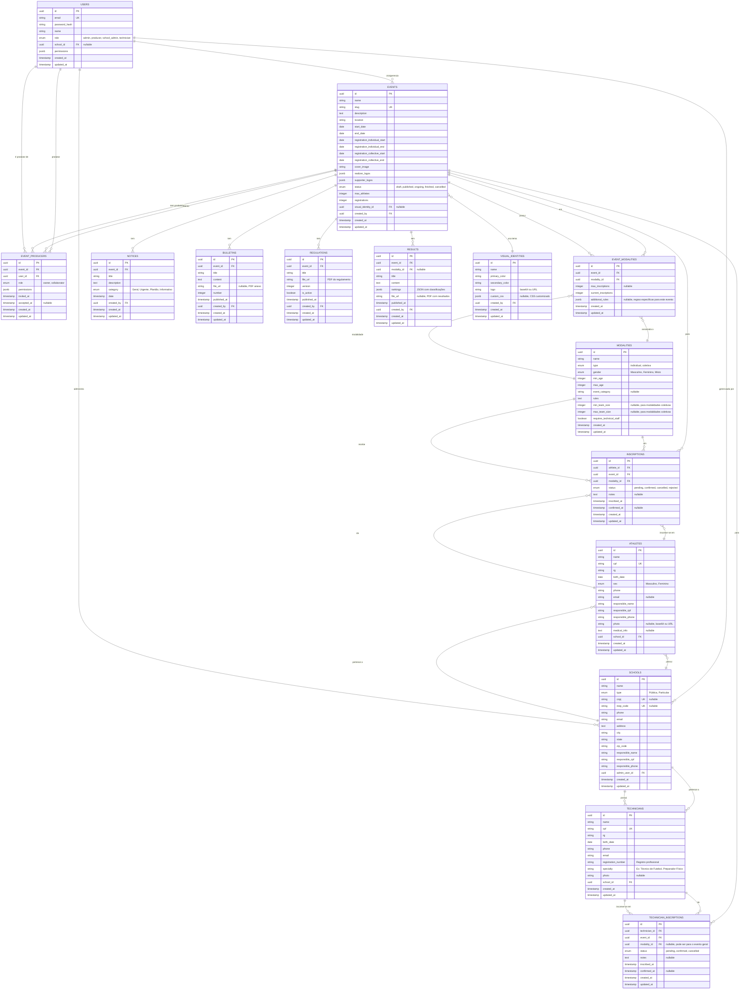

# Schema do Banco de Dados - Gerador de Eventos

## 📊 Visão Geral

Este documento apresenta o **schema completo do banco de dados** para a aplicação Gerador de Eventos, baseado no [flowchart de UX/UI](./UX-UI-FLOWCHART.md) e nas funcionalidades mapeadas.

### 🎯 Banco de Dados Recomendado
**PostgreSQL 14+** (produção) ou **SQLite** (desenvolvimento/testes)

---

## 🗺️ Diagrama Entidade-Relacionamento (ER)



---

## 📋 Descrição Detalhada das Tabelas

### 1. **USERS** - Usuários do Sistema

Armazena todos os usuários (Produtores, Administradores de Escola, Técnicos).

**Campos Principais:**
- `role`: Define o tipo de usuário e suas permissões base
- `permissions`: JSONB com permissões específicas para controle granular
- `school_id`: Relaciona usuário com escola (para school_admin e technician)

**Índices:**
```sql
CREATE UNIQUE INDEX idx_users_email ON users(email);
CREATE INDEX idx_users_role ON users(role);
CREATE INDEX idx_users_school_id ON users(school_id);
```

---

### 2. **EVENTS** - Eventos Esportivos

Armazena todos os eventos criados pelos produtores.

**Campos Principais:**
- `slug`: URL-friendly identifier para páginas públicas
- `status`: Controla o ciclo de vida do evento
- `realizer_logos`, `supporter_logos`: Arrays JSON com logos em base64
- `registrations`: Contador desnormalizado para performance

**Índices:**
```sql
CREATE UNIQUE INDEX idx_events_slug ON events(slug);
CREATE INDEX idx_events_status ON events(status);
CREATE INDEX idx_events_dates ON events(start_date, end_date);
CREATE INDEX idx_events_creator ON events(created_by);
```

---

### 3. **MODALITIES** - Modalidades Esportivas

Catálogo de modalidades disponíveis (Futsal, Voleibol, etc.).

**Campos Principais:**
- `type`: Individual ou coletiva
- `min_team_size`, `max_team_size`: Apenas para modalidades coletivas
- `requires_technical_staff`: Define se precisa técnico inscrito

**Índices:**
```sql
CREATE INDEX idx_modalities_type ON modalities(type);
CREATE INDEX idx_modalities_gender ON modalities(gender);
CREATE INDEX idx_modalities_age ON modalities(min_age, max_age);
```

---

### 4. **SCHOOLS** - Escolas/Instituições

Escolas participantes dos eventos.

**Campos Principais:**
- `type`: Pública ou Particular
- `cnpj`, `inep_code`: Identificadores únicos
- `admin_user_id`: Relaciona com o usuário administrador

**Índices:**
```sql
CREATE UNIQUE INDEX idx_schools_cnpj ON schools(cnpj) WHERE cnpj IS NOT NULL;
CREATE UNIQUE INDEX idx_schools_inep ON schools(inep_code) WHERE inep_code IS NOT NULL;
CREATE INDEX idx_schools_admin ON schools(admin_user_id);
CREATE INDEX idx_schools_type ON schools(type);
```

---

### 5. **ATHLETES** - Atletas

Atletas cadastrados pelas escolas.

**Campos Principais:**
- `cpf`: Identificador único do atleta
- `medical_info`: Informações médicas relevantes
- `photo`: Base64 ou URL da foto

**Índices:**
```sql
CREATE UNIQUE INDEX idx_athletes_cpf ON athletes(cpf);
CREATE INDEX idx_athletes_school ON athletes(school_id);
CREATE INDEX idx_athletes_birth ON athletes(birth_date);
```

---

### 6. **TECHNICIANS** - Técnicos/Treinadores

Técnicos vinculados às escolas.

**Campos Principais:**
- `registration_number`: Registro profissional (CREF, etc.)
- `specialty`: Área de atuação

**Índices:**
```sql
CREATE UNIQUE INDEX idx_technicians_cpf ON technicians(cpf);
CREATE INDEX idx_technicians_school ON technicians(school_id);
```

---

### 7. **INSCRIPTIONS** - Inscrições de Atletas

Relaciona atletas com modalidades de eventos.

**Campos Principais:**
- `status`: pending, confirmed, cancelled, rejected
- `inscribed_at`, `confirmed_at`: Timestamps de controle

**Índices:**
```sql
CREATE INDEX idx_inscriptions_athlete ON inscriptions(athlete_id);
CREATE INDEX idx_inscriptions_event ON inscriptions(event_id);
CREATE INDEX idx_inscriptions_modality ON inscriptions(modality_id);
CREATE INDEX idx_inscriptions_status ON inscriptions(status);
CREATE UNIQUE INDEX idx_inscriptions_unique ON inscriptions(athlete_id, event_id, modality_id);
```

---

### 8. **EVENT_MODALITIES** - Associação Evento-Modalidade

Tabela de junção many-to-many entre eventos e modalidades.

**Campos Principais:**
- `max_inscriptions`: Limite específico para este evento
- `current_inscriptions`: Contador desnormalizado
- `additional_rules`: Regras JSON específicas

**Índices:**
```sql
CREATE INDEX idx_event_modalities_event ON event_modalities(event_id);
CREATE INDEX idx_event_modalities_modality ON event_modalities(modality_id);
CREATE UNIQUE INDEX idx_event_modalities_unique ON event_modalities(event_id, modality_id);
```

---

### 9. **EVENT_PRODUCERS** - Produtores de Eventos

Relaciona usuários produtores com eventos (permite múltiplos produtores por evento).

**Campos Principais:**
- `role`: owner (criador) ou collaborator
- `permissions`: JSONB com permissões específicas no evento

**Índices:**
```sql
CREATE INDEX idx_event_producers_event ON event_producers(event_id);
CREATE INDEX idx_event_producers_user ON event_producers(user_id);
CREATE UNIQUE INDEX idx_event_producers_unique ON event_producers(event_id, user_id);
```

---

### 10-14. **Comunicação** (NOTICES, BULLETINS, REGULATIONS, RESULTS)

Tabelas de comunicação vinculadas aos eventos.

**Índices Comuns:**
```sql
-- Para cada tabela de comunicação
CREATE INDEX idx_{table}_event ON {table}(event_id);
CREATE INDEX idx_{table}_created_by ON {table}(created_by);
CREATE INDEX idx_{table}_date ON {table}(published_at);
```

---

## 🔧 DDL SQL Completo (PostgreSQL)

```sql
-- =====================================================
-- EXTENSÕES
-- =====================================================
CREATE EXTENSION IF NOT EXISTS "uuid-ossp";

-- =====================================================
-- ENUMS
-- =====================================================
CREATE TYPE user_role AS ENUM ('admin', 'producer', 'school_admin', 'technician');
CREATE TYPE event_status AS ENUM ('draft', 'published', 'ongoing', 'finished', 'cancelled');
CREATE TYPE modality_type AS ENUM ('individual', 'coletiva');
CREATE TYPE gender_type AS ENUM ('Masculino', 'Feminino', 'Misto');
CREATE TYPE school_type AS ENUM ('Pública', 'Particular');
CREATE TYPE inscription_status AS ENUM ('pending', 'confirmed', 'cancelled', 'rejected');
CREATE TYPE notice_category AS ENUM ('Geral', 'Urgente', 'Plantão', 'Informativo');
CREATE TYPE producer_role AS ENUM ('owner', 'collaborator');

-- =====================================================
-- TABELA: USERS
-- =====================================================
CREATE TABLE users (
    id UUID PRIMARY KEY DEFAULT uuid_generate_v4(),
    email VARCHAR(255) NOT NULL UNIQUE,
    password_hash VARCHAR(255) NOT NULL,
    name VARCHAR(255) NOT NULL,
    role user_role NOT NULL DEFAULT 'school_admin',
    school_id UUID,
    permissions JSONB DEFAULT '[]'::jsonb,
    created_at TIMESTAMP NOT NULL DEFAULT NOW(),
    updated_at TIMESTAMP NOT NULL DEFAULT NOW()
);

CREATE INDEX idx_users_email ON users(email);
CREATE INDEX idx_users_role ON users(role);
CREATE INDEX idx_users_school_id ON users(school_id);

-- =====================================================
-- TABELA: VISUAL_IDENTITIES
-- =====================================================
CREATE TABLE visual_identities (
    id UUID PRIMARY KEY DEFAULT uuid_generate_v4(),
    name VARCHAR(255) NOT NULL,
    primary_color VARCHAR(7) NOT NULL,
    secondary_color VARCHAR(7) NOT NULL,
    logo TEXT,
    custom_css JSONB,
    created_by UUID NOT NULL REFERENCES users(id) ON DELETE CASCADE,
    created_at TIMESTAMP NOT NULL DEFAULT NOW(),
    updated_at TIMESTAMP NOT NULL DEFAULT NOW()
);

CREATE INDEX idx_visual_identities_creator ON visual_identities(created_by);

-- =====================================================
-- TABELA: EVENTS
-- =====================================================
CREATE TABLE events (
    id UUID PRIMARY KEY DEFAULT uuid_generate_v4(),
    name VARCHAR(255) NOT NULL,
    slug VARCHAR(255) NOT NULL UNIQUE,
    description TEXT,
    location VARCHAR(255),
    start_date DATE NOT NULL,
    end_date DATE NOT NULL,
    registration_individual_start DATE,
    registration_individual_end DATE,
    registration_collective_start DATE,
    registration_collective_end DATE,
    cover_image TEXT,
    realizer_logos JSONB DEFAULT '[]'::jsonb,
    supporter_logos JSONB DEFAULT '[]'::jsonb,
    status event_status NOT NULL DEFAULT 'draft',
    max_athletes INTEGER,
    registrations INTEGER DEFAULT 0,
    visual_identity_id UUID REFERENCES visual_identities(id) ON DELETE SET NULL,
    created_by UUID NOT NULL REFERENCES users(id) ON DELETE CASCADE,
    created_at TIMESTAMP NOT NULL DEFAULT NOW(),
    updated_at TIMESTAMP NOT NULL DEFAULT NOW(),
    
    CONSTRAINT check_dates CHECK (end_date >= start_date)
);

CREATE UNIQUE INDEX idx_events_slug ON events(slug);
CREATE INDEX idx_events_status ON events(status);
CREATE INDEX idx_events_dates ON events(start_date, end_date);
CREATE INDEX idx_events_creator ON events(created_by);
CREATE INDEX idx_events_visual_identity ON events(visual_identity_id);

-- =====================================================
-- TABELA: MODALITIES
-- =====================================================
CREATE TABLE modalities (
    id UUID PRIMARY KEY DEFAULT uuid_generate_v4(),
    name VARCHAR(255) NOT NULL,
    type modality_type NOT NULL,
    gender gender_type NOT NULL,
    min_age INTEGER NOT NULL,
    max_age INTEGER NOT NULL,
    event_category VARCHAR(255),
    rules TEXT,
    min_team_size INTEGER,
    max_team_size INTEGER,
    requires_technical_staff BOOLEAN DEFAULT false,
    created_at TIMESTAMP NOT NULL DEFAULT NOW(),
    updated_at TIMESTAMP NOT NULL DEFAULT NOW(),
    
    CONSTRAINT check_age_range CHECK (max_age >= min_age),
    CONSTRAINT check_team_size_for_coletiva CHECK (
        (type = 'individual') OR 
        (type = 'coletiva' AND min_team_size IS NOT NULL AND max_team_size IS NOT NULL)
    )
);

CREATE INDEX idx_modalities_type ON modalities(type);
CREATE INDEX idx_modalities_gender ON modalities(gender);
CREATE INDEX idx_modalities_age ON modalities(min_age, max_age);

-- =====================================================
-- TABELA: SCHOOLS
-- =====================================================
CREATE TABLE schools (
    id UUID PRIMARY KEY DEFAULT uuid_generate_v4(),
    name VARCHAR(255) NOT NULL,
    type school_type NOT NULL,
    cnpj VARCHAR(18) UNIQUE,
    inep_code VARCHAR(20) UNIQUE,
    phone VARCHAR(20),
    email VARCHAR(255),
    address TEXT,
    city VARCHAR(100),
    state VARCHAR(2),
    zip_code VARCHAR(10),
    responsible_name VARCHAR(255) NOT NULL,
    responsible_cpf VARCHAR(14) NOT NULL,
    responsible_phone VARCHAR(20),
    admin_user_id UUID REFERENCES users(id) ON DELETE SET NULL,
    created_at TIMESTAMP NOT NULL DEFAULT NOW(),
    updated_at TIMESTAMP NOT NULL DEFAULT NOW()
);

CREATE UNIQUE INDEX idx_schools_cnpj ON schools(cnpj) WHERE cnpj IS NOT NULL;
CREATE UNIQUE INDEX idx_schools_inep ON schools(inep_code) WHERE inep_code IS NOT NULL;
CREATE INDEX idx_schools_admin ON schools(admin_user_id);
CREATE INDEX idx_schools_type ON schools(type);

-- Adicionar FK de users.school_id agora que schools existe
ALTER TABLE users 
    ADD CONSTRAINT fk_users_school 
    FOREIGN KEY (school_id) REFERENCES schools(id) ON DELETE SET NULL;

-- =====================================================
-- TABELA: ATHLETES
-- =====================================================
CREATE TABLE athletes (
    id UUID PRIMARY KEY DEFAULT uuid_generate_v4(),
    name VARCHAR(255) NOT NULL,
    cpf VARCHAR(14) NOT NULL UNIQUE,
    rg VARCHAR(20),
    birth_date DATE NOT NULL,
    sex gender_type NOT NULL,
    phone VARCHAR(20),
    email VARCHAR(255),
    responsible_name VARCHAR(255) NOT NULL,
    responsible_cpf VARCHAR(14) NOT NULL,
    responsible_phone VARCHAR(20) NOT NULL,
    photo TEXT,
    medical_info TEXT,
    school_id UUID NOT NULL REFERENCES schools(id) ON DELETE CASCADE,
    created_at TIMESTAMP NOT NULL DEFAULT NOW(),
    updated_at TIMESTAMP NOT NULL DEFAULT NOW()
);

CREATE UNIQUE INDEX idx_athletes_cpf ON athletes(cpf);
CREATE INDEX idx_athletes_school ON athletes(school_id);
CREATE INDEX idx_athletes_birth ON athletes(birth_date);
CREATE INDEX idx_athletes_name ON athletes(name);

-- =====================================================
-- TABELA: TECHNICIANS
-- =====================================================
CREATE TABLE technicians (
    id UUID PRIMARY KEY DEFAULT uuid_generate_v4(),
    name VARCHAR(255) NOT NULL,
    cpf VARCHAR(14) NOT NULL UNIQUE,
    rg VARCHAR(20),
    birth_date DATE NOT NULL,
    phone VARCHAR(20) NOT NULL,
    email VARCHAR(255),
    registration_number VARCHAR(50),
    specialty VARCHAR(255),
    photo TEXT,
    school_id UUID NOT NULL REFERENCES schools(id) ON DELETE CASCADE,
    created_at TIMESTAMP NOT NULL DEFAULT NOW(),
    updated_at TIMESTAMP NOT NULL DEFAULT NOW()
);

CREATE UNIQUE INDEX idx_technicians_cpf ON technicians(cpf);
CREATE INDEX idx_technicians_school ON technicians(school_id);
CREATE INDEX idx_technicians_name ON technicians(name);

-- =====================================================
-- TABELA: EVENT_MODALITIES
-- =====================================================
CREATE TABLE event_modalities (
    id UUID PRIMARY KEY DEFAULT uuid_generate_v4(),
    event_id UUID NOT NULL REFERENCES events(id) ON DELETE CASCADE,
    modality_id UUID NOT NULL REFERENCES modalities(id) ON DELETE CASCADE,
    max_inscriptions INTEGER,
    current_inscriptions INTEGER DEFAULT 0,
    additional_rules JSONB,
    created_at TIMESTAMP NOT NULL DEFAULT NOW(),
    updated_at TIMESTAMP NOT NULL DEFAULT NOW(),
    
    CONSTRAINT unique_event_modality UNIQUE(event_id, modality_id)
);

CREATE INDEX idx_event_modalities_event ON event_modalities(event_id);
CREATE INDEX idx_event_modalities_modality ON event_modalities(modality_id);

-- =====================================================
-- TABELA: INSCRIPTIONS
-- =====================================================
CREATE TABLE inscriptions (
    id UUID PRIMARY KEY DEFAULT uuid_generate_v4(),
    athlete_id UUID NOT NULL REFERENCES athletes(id) ON DELETE CASCADE,
    event_id UUID NOT NULL REFERENCES events(id) ON DELETE CASCADE,
    modality_id UUID NOT NULL REFERENCES modalities(id) ON DELETE CASCADE,
    status inscription_status NOT NULL DEFAULT 'pending',
    notes TEXT,
    inscribed_at TIMESTAMP NOT NULL DEFAULT NOW(),
    confirmed_at TIMESTAMP,
    created_at TIMESTAMP NOT NULL DEFAULT NOW(),
    updated_at TIMESTAMP NOT NULL DEFAULT NOW(),
    
    CONSTRAINT unique_athlete_event_modality UNIQUE(athlete_id, event_id, modality_id)
);

CREATE INDEX idx_inscriptions_athlete ON inscriptions(athlete_id);
CREATE INDEX idx_inscriptions_event ON inscriptions(event_id);
CREATE INDEX idx_inscriptions_modality ON inscriptions(modality_id);
CREATE INDEX idx_inscriptions_status ON inscriptions(status);

-- =====================================================
-- TABELA: TECHNICIAN_INSCRIPTIONS
-- =====================================================
CREATE TABLE technician_inscriptions (
    id UUID PRIMARY KEY DEFAULT uuid_generate_v4(),
    technician_id UUID NOT NULL REFERENCES technicians(id) ON DELETE CASCADE,
    event_id UUID NOT NULL REFERENCES events(id) ON DELETE CASCADE,
    modality_id UUID REFERENCES modalities(id) ON DELETE SET NULL,
    status inscription_status NOT NULL DEFAULT 'pending',
    notes TEXT,
    inscribed_at TIMESTAMP NOT NULL DEFAULT NOW(),
    confirmed_at TIMESTAMP,
    created_at TIMESTAMP NOT NULL DEFAULT NOW(),
    updated_at TIMESTAMP NOT NULL DEFAULT NOW()
);

CREATE INDEX idx_technician_inscriptions_technician ON technician_inscriptions(technician_id);
CREATE INDEX idx_technician_inscriptions_event ON technician_inscriptions(event_id);
CREATE INDEX idx_technician_inscriptions_status ON technician_inscriptions(status);

-- =====================================================
-- TABELA: EVENT_PRODUCERS
-- =====================================================
CREATE TABLE event_producers (
    id UUID PRIMARY KEY DEFAULT uuid_generate_v4(),
    event_id UUID NOT NULL REFERENCES events(id) ON DELETE CASCADE,
    user_id UUID NOT NULL REFERENCES users(id) ON DELETE CASCADE,
    role producer_role NOT NULL DEFAULT 'collaborator',
    permissions JSONB DEFAULT '[]'::jsonb,
    invited_at TIMESTAMP NOT NULL DEFAULT NOW(),
    accepted_at TIMESTAMP,
    created_at TIMESTAMP NOT NULL DEFAULT NOW(),
    updated_at TIMESTAMP NOT NULL DEFAULT NOW(),
    
    CONSTRAINT unique_event_user UNIQUE(event_id, user_id)
);

CREATE INDEX idx_event_producers_event ON event_producers(event_id);
CREATE INDEX idx_event_producers_user ON event_producers(user_id);

-- =====================================================
-- TABELA: NOTICES (Avisos)
-- =====================================================
CREATE TABLE notices (
    id UUID PRIMARY KEY DEFAULT uuid_generate_v4(),
    event_id UUID NOT NULL REFERENCES events(id) ON DELETE CASCADE,
    title VARCHAR(500) NOT NULL,
    description TEXT,
    category notice_category NOT NULL DEFAULT 'Geral',
    date TIMESTAMP NOT NULL DEFAULT NOW(),
    created_by UUID NOT NULL REFERENCES users(id) ON DELETE CASCADE,
    created_at TIMESTAMP NOT NULL DEFAULT NOW(),
    updated_at TIMESTAMP NOT NULL DEFAULT NOW()
);

CREATE INDEX idx_notices_event ON notices(event_id);
CREATE INDEX idx_notices_category ON notices(category);
CREATE INDEX idx_notices_date ON notices(date);
CREATE INDEX idx_notices_creator ON notices(created_by);

-- =====================================================
-- TABELA: BULLETINS (Boletins)
-- =====================================================
CREATE TABLE bulletins (
    id UUID PRIMARY KEY DEFAULT uuid_generate_v4(),
    event_id UUID NOT NULL REFERENCES events(id) ON DELETE CASCADE,
    title VARCHAR(500) NOT NULL,
    content TEXT,
    file_url TEXT,
    number INTEGER NOT NULL,
    published_at TIMESTAMP NOT NULL DEFAULT NOW(),
    created_by UUID NOT NULL REFERENCES users(id) ON DELETE CASCADE,
    created_at TIMESTAMP NOT NULL DEFAULT NOW(),
    updated_at TIMESTAMP NOT NULL DEFAULT NOW()
);

CREATE INDEX idx_bulletins_event ON bulletins(event_id);
CREATE INDEX idx_bulletins_number ON bulletins(number);
CREATE INDEX idx_bulletins_published ON bulletins(published_at);
CREATE INDEX idx_bulletins_creator ON bulletins(created_by);

-- =====================================================
-- TABELA: REGULATIONS (Regulamentos)
-- =====================================================
CREATE TABLE regulations (
    id UUID PRIMARY KEY DEFAULT uuid_generate_v4(),
    event_id UUID NOT NULL REFERENCES events(id) ON DELETE CASCADE,
    title VARCHAR(500) NOT NULL,
    file_url TEXT NOT NULL,
    version INTEGER NOT NULL DEFAULT 1,
    is_active BOOLEAN DEFAULT true,
    published_at TIMESTAMP NOT NULL DEFAULT NOW(),
    created_by UUID NOT NULL REFERENCES users(id) ON DELETE CASCADE,
    created_at TIMESTAMP NOT NULL DEFAULT NOW(),
    updated_at TIMESTAMP NOT NULL DEFAULT NOW()
);

CREATE INDEX idx_regulations_event ON regulations(event_id);
CREATE INDEX idx_regulations_active ON regulations(is_active);
CREATE INDEX idx_regulations_published ON regulations(published_at);
CREATE INDEX idx_regulations_creator ON regulations(created_by);

-- =====================================================
-- TABELA: RESULTS (Resultados)
-- =====================================================
CREATE TABLE results (
    id UUID PRIMARY KEY DEFAULT uuid_generate_v4(),
    event_id UUID NOT NULL REFERENCES events(id) ON DELETE CASCADE,
    modality_id UUID REFERENCES modalities(id) ON DELETE SET NULL,
    title VARCHAR(500) NOT NULL,
    content TEXT,
    rankings JSONB,
    file_url TEXT,
    published_at TIMESTAMP NOT NULL DEFAULT NOW(),
    created_by UUID NOT NULL REFERENCES users(id) ON DELETE CASCADE,
    created_at TIMESTAMP NOT NULL DEFAULT NOW(),
    updated_at TIMESTAMP NOT NULL DEFAULT NOW()
);

CREATE INDEX idx_results_event ON results(event_id);
CREATE INDEX idx_results_modality ON results(modality_id);
CREATE INDEX idx_results_published ON results(published_at);
CREATE INDEX idx_results_creator ON results(created_by);

-- =====================================================
-- TRIGGERS PARA updated_at
-- =====================================================
CREATE OR REPLACE FUNCTION update_updated_at_column()
RETURNS TRIGGER AS $$
BEGIN
    NEW.updated_at = NOW();
    RETURN NEW;
END;
$$ language 'plpgsql';

-- Aplicar trigger em todas as tabelas
CREATE TRIGGER update_users_updated_at BEFORE UPDATE ON users FOR EACH ROW EXECUTE FUNCTION update_updated_at_column();
CREATE TRIGGER update_events_updated_at BEFORE UPDATE ON events FOR EACH ROW EXECUTE FUNCTION update_updated_at_column();
CREATE TRIGGER update_modalities_updated_at BEFORE UPDATE ON modalities FOR EACH ROW EXECUTE FUNCTION update_updated_at_column();
CREATE TRIGGER update_schools_updated_at BEFORE UPDATE ON schools FOR EACH ROW EXECUTE FUNCTION update_updated_at_column();
CREATE TRIGGER update_athletes_updated_at BEFORE UPDATE ON athletes FOR EACH ROW EXECUTE FUNCTION update_updated_at_column();
CREATE TRIGGER update_technicians_updated_at BEFORE UPDATE ON technicians FOR EACH ROW EXECUTE FUNCTION update_updated_at_column();
CREATE TRIGGER update_inscriptions_updated_at BEFORE UPDATE ON inscriptions FOR EACH ROW EXECUTE FUNCTION update_updated_at_column();
CREATE TRIGGER update_technician_inscriptions_updated_at BEFORE UPDATE ON technician_inscriptions FOR EACH ROW EXECUTE FUNCTION update_updated_at_column();
CREATE TRIGGER update_event_modalities_updated_at BEFORE UPDATE ON event_modalities FOR EACH ROW EXECUTE FUNCTION update_updated_at_column();
CREATE TRIGGER update_event_producers_updated_at BEFORE UPDATE ON event_producers FOR EACH ROW EXECUTE FUNCTION update_updated_at_column();
CREATE TRIGGER update_visual_identities_updated_at BEFORE UPDATE ON visual_identities FOR EACH ROW EXECUTE FUNCTION update_updated_at_column();
CREATE TRIGGER update_notices_updated_at BEFORE UPDATE ON notices FOR EACH ROW EXECUTE FUNCTION update_updated_at_column();
CREATE TRIGGER update_bulletins_updated_at BEFORE UPDATE ON bulletins FOR EACH ROW EXECUTE FUNCTION update_updated_at_column();
CREATE TRIGGER update_regulations_updated_at BEFORE UPDATE ON regulations FOR EACH ROW EXECUTE FUNCTION update_updated_at_column();
CREATE TRIGGER update_results_updated_at BEFORE UPDATE ON results FOR EACH ROW EXECUTE FUNCTION update_updated_at_column();
```

---

## 📊 Queries Comuns

### 1. Listar todos os atletas de uma escola com suas inscrições

```sql
SELECT 
    a.id,
    a.name,
    a.cpf,
    a.birth_date,
    s.name as school_name,
    COUNT(i.id) as total_inscriptions,
    ARRAY_AGG(DISTINCT e.name) FILTER (WHERE e.name IS NOT NULL) as events
FROM athletes a
LEFT JOIN schools s ON a.school_id = s.id
LEFT JOIN inscriptions i ON a.id = i.athlete_id AND i.status = 'confirmed'
LEFT JOIN events e ON i.event_id = e.id
WHERE a.school_id = 'uuid-da-escola'
GROUP BY a.id, a.name, a.cpf, a.birth_date, s.name
ORDER BY a.name;
```

### 2. Obter estatísticas de um evento

```sql
SELECT 
    e.id,
    e.name,
    e.status,
    COUNT(DISTINCT i.athlete_id) as total_athletes,
    COUNT(DISTINCT s.id) as total_schools,
    COUNT(DISTINCT em.modality_id) as total_modalities,
    COUNT(DISTINCT CASE WHEN s.type = 'Pública' THEN s.id END) as public_schools,
    COUNT(DISTINCT CASE WHEN s.type = 'Particular' THEN s.id END) as private_schools
FROM events e
LEFT JOIN inscriptions i ON e.id = i.event_id AND i.status = 'confirmed'
LEFT JOIN athletes a ON i.athlete_id = a.id
LEFT JOIN schools s ON a.school_id = s.id
LEFT JOIN event_modalities em ON e.id = em.event_id
WHERE e.id = 'uuid-do-evento'
GROUP BY e.id, e.name, e.status;
```

### 3. Listar modalidades de um evento com contagem de inscrições

```sql
SELECT 
    m.id,
    m.name,
    m.type,
    m.gender,
    CONCAT(m.min_age, ' a ', m.max_age) as age_range,
    em.max_inscriptions,
    COUNT(i.id) as current_inscriptions,
    CASE 
        WHEN em.max_inscriptions IS NOT NULL 
        THEN em.max_inscriptions - COUNT(i.id)
        ELSE NULL
    END as available_slots
FROM modalities m
INNER JOIN event_modalities em ON m.id = em.modality_id
LEFT JOIN inscriptions i ON em.modality_id = i.modality_id 
    AND i.event_id = em.event_id 
    AND i.status = 'confirmed'
WHERE em.event_id = 'uuid-do-evento'
GROUP BY m.id, m.name, m.type, m.gender, m.min_age, m.max_age, em.max_inscriptions
ORDER BY m.name;
```

### 4. Buscar atletas elegíveis para uma modalidade

```sql
SELECT 
    a.id,
    a.name,
    a.cpf,
    a.birth_date,
    a.sex,
    s.name as school_name,
    EXTRACT(YEAR FROM AGE(a.birth_date)) as age
FROM athletes a
INNER JOIN schools s ON a.school_id = s.id
WHERE a.sex = 'Masculino' -- gender da modalidade
  AND EXTRACT(YEAR FROM AGE(a.birth_date)) BETWEEN 12 AND 14 -- idade da modalidade
  AND NOT EXISTS (
      SELECT 1 FROM inscriptions i
      WHERE i.athlete_id = a.id
        AND i.event_id = 'uuid-do-evento'
        AND i.modality_id = 'uuid-da-modalidade'
        AND i.status IN ('pending', 'confirmed')
  )
ORDER BY a.name;
```

### 5. Relatório de inscrições por escola em um evento

```sql
SELECT 
    s.id,
    s.name as school_name,
    s.type as school_type,
    COUNT(DISTINCT a.id) as total_athletes_inscribed,
    COUNT(DISTINCT i.id) as total_inscriptions,
    COUNT(DISTINCT i.modality_id) as modalities_count,
    ARRAY_AGG(DISTINCT m.name) as modalities
FROM schools s
INNER JOIN athletes a ON s.id = a.school_id
INNER JOIN inscriptions i ON a.id = i.athlete_id
INNER JOIN modalities m ON i.modality_id = m.id
WHERE i.event_id = 'uuid-do-evento'
  AND i.status = 'confirmed'
GROUP BY s.id, s.name, s.type
ORDER BY total_inscriptions DESC;
```

### 6. Avisos recentes de um evento (Plantão)

```sql
SELECT 
    n.id,
    n.title,
    n.description,
    n.category,
    n.date,
    u.name as author
FROM notices n
INNER JOIN users u ON n.created_by = u.id
WHERE n.event_id = 'uuid-do-evento'
  AND n.category IN ('Urgente', 'Plantão')
ORDER BY n.date DESC
LIMIT 10;
```

---

## 🔄 Migrações e Versionamento

### Estratégia de Migração

Usar ferramenta como **Prisma**, **Drizzle ORM**, ou **TypeORM** para gerenciar migrações.

Exemplo com Prisma:
```bash
npx prisma migrate dev --name init
npx prisma generate
```

### Seeds (Dados Iniciais)

```sql
-- Inserir usuário admin padrão
INSERT INTO users (email, password_hash, name, role, permissions)
VALUES (
    'admin@geradordeeventos.com',
    '$2b$10$...', -- hash bcrypt de 'admin123'
    'Administrador Sistema',
    'admin',
    '["*"]'::jsonb
);

-- Inserir modalidades padrão
INSERT INTO modalities (name, type, gender, min_age, max_age, min_team_size, max_team_size)
VALUES 
    ('Futsal', 'coletiva', 'Masculino', 12, 14, 5, 12),
    ('Futsal', 'coletiva', 'Feminino', 12, 14, 5, 12),
    ('Voleibol', 'coletiva', 'Masculino', 15, 17, 6, 12),
    ('Basquete', 'coletiva', 'Misto', 12, 17, 5, 12),
    ('Atletismo 100m', 'individual', 'Masculino', 12, 17, NULL, NULL),
    ('Xadrez', 'individual', 'Misto', 10, 18, NULL, NULL);
```

---

## 🔒 Segurança e Performance

### Índices Compostos Adicionais

Para otimizar queries comuns:

```sql
-- Para busca de inscrições por evento e status
CREATE INDEX idx_inscriptions_event_status ON inscriptions(event_id, status);

-- Para busca de atletas por escola e sexo
CREATE INDEX idx_athletes_school_sex ON athletes(school_id, sex);

-- Para busca de modalidades por tipo e gênero
CREATE INDEX idx_modalities_type_gender ON modalities(type, gender);
```

### Row Level Security (RLS) - PostgreSQL

```sql
-- Habilitar RLS
ALTER TABLE athletes ENABLE ROW LEVEL SECURITY;

-- Política: Escolas só veem seus próprios atletas
CREATE POLICY athletes_school_isolation ON athletes
    FOR ALL
    USING (
        school_id = (
            SELECT school_id FROM users WHERE id = current_user_id()
        )
    );
```

### Constraints de Integridade

```sql
-- Limitar idade mínima de atletas
ALTER TABLE athletes 
    ADD CONSTRAINT check_athlete_min_age 
    CHECK (birth_date <= CURRENT_DATE - INTERVAL '5 years');

-- Limitar máximo de inscrições por evento
CREATE OR REPLACE FUNCTION check_event_max_inscriptions()
RETURNS TRIGGER AS $$
BEGIN
    IF (
        SELECT registrations >= max_athletes
        FROM events
        WHERE id = NEW.event_id AND max_athletes IS NOT NULL
    ) THEN
        RAISE EXCEPTION 'Evento já atingiu o número máximo de inscrições';
    END IF;
    RETURN NEW;
END;
$$ LANGUAGE plpgsql;

CREATE TRIGGER enforce_event_max_inscriptions
    BEFORE INSERT ON inscriptions
    FOR EACH ROW
    EXECUTE FUNCTION check_event_max_inscriptions();
```

---

## 📈 Monitoramento e Métricas

### Views Úteis para Dashboards

```sql
-- View: Resumo de eventos ativos
CREATE VIEW v_active_events_summary AS
SELECT 
    e.id,
    e.name,
    e.status,
    e.start_date,
    e.end_date,
    COUNT(DISTINCT i.athlete_id) as athletes_count,
    COUNT(DISTINCT a.school_id) as schools_count,
    COUNT(DISTINCT em.modality_id) as modalities_count
FROM events e
LEFT JOIN inscriptions i ON e.id = i.event_id AND i.status = 'confirmed'
LEFT JOIN athletes a ON i.athlete_id = a.id
LEFT JOIN event_modalities em ON e.id = em.event_id
WHERE e.status IN ('published', 'ongoing')
GROUP BY e.id, e.name, e.status, e.start_date, e.end_date;

-- View: Ranking de escolas por participação
CREATE VIEW v_schools_ranking AS
SELECT 
    s.id,
    s.name,
    s.type,
    COUNT(DISTINCT a.id) as total_athletes,
    COUNT(DISTINCT i.event_id) as events_participated,
    COUNT(DISTINCT i.id) as total_inscriptions
FROM schools s
LEFT JOIN athletes a ON s.id = a.school_id
LEFT JOIN inscriptions i ON a.id = i.athlete_id AND i.status = 'confirmed'
GROUP BY s.id, s.name, s.type
ORDER BY total_inscriptions DESC;
```

---

## 🚀 Próximos Passos

1. **Implementar ORM** (Prisma, Drizzle, TypeORM)
2. **Criar API REST** (Express, Fastify, NestJS)
3. **Adicionar Cache** (Redis para queries frequentes)
4. **Implementar Full-Text Search** (PostgreSQL FTS ou ElasticSearch)
5. **Configurar Backups Automáticos**
6. **Adicionar Auditoria** (tabela de audit_logs)

---

**Última Atualização**: 2025-12-10  
**Versão do Schema**: 1.0.0  
**Compatível com**: PostgreSQL 14+, SQLite 3.35+
