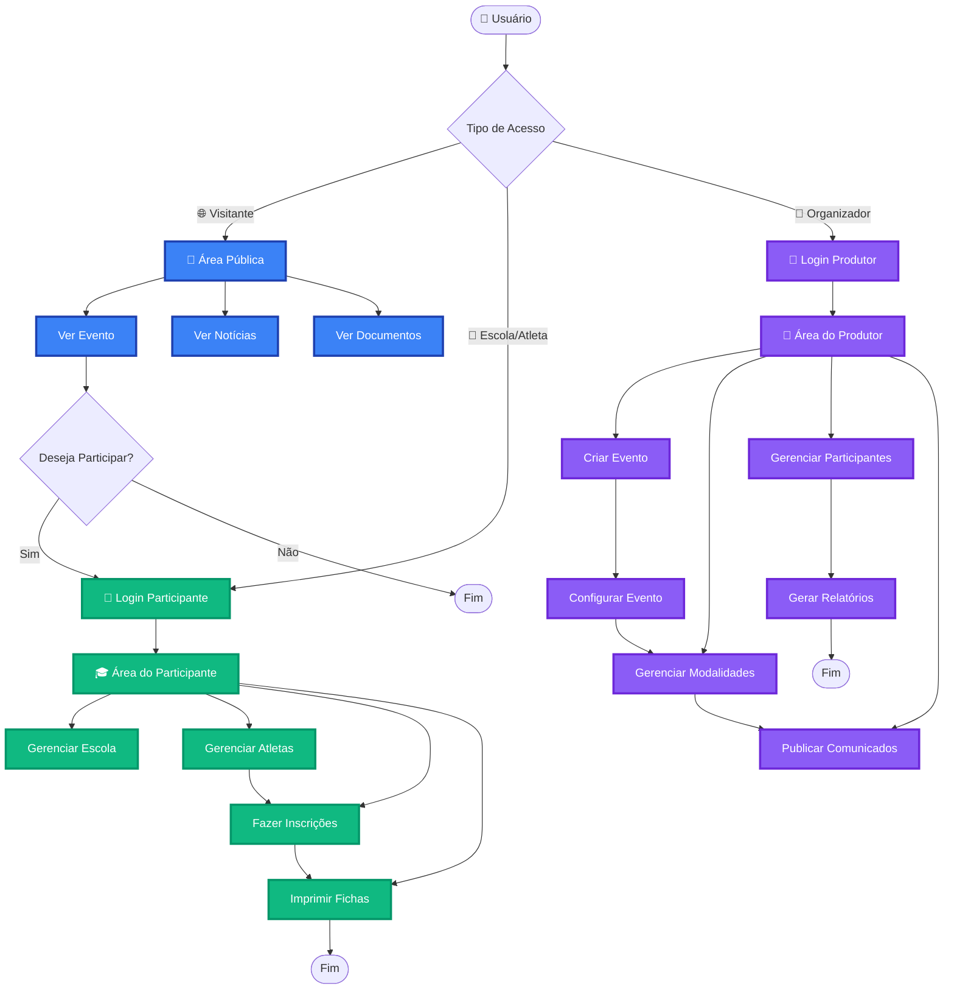
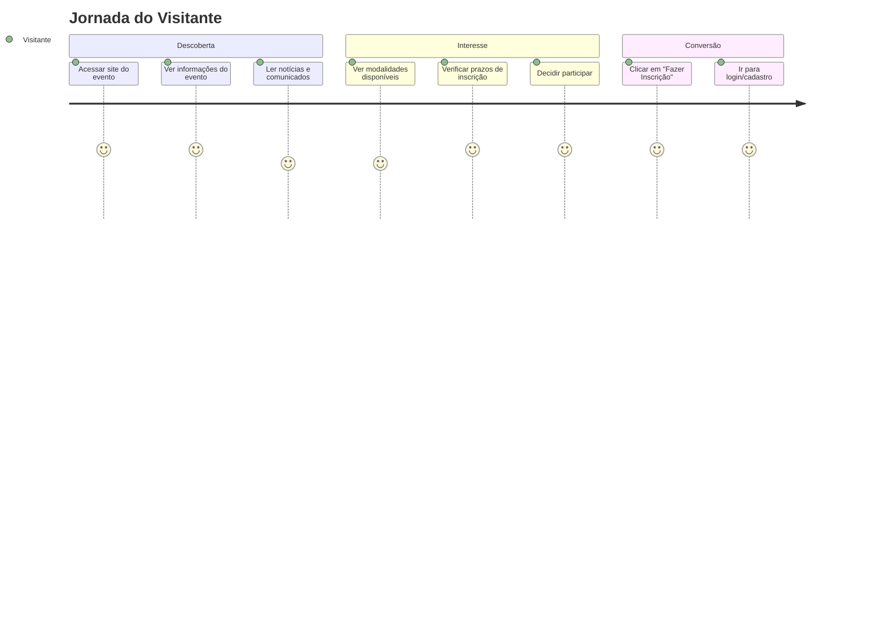
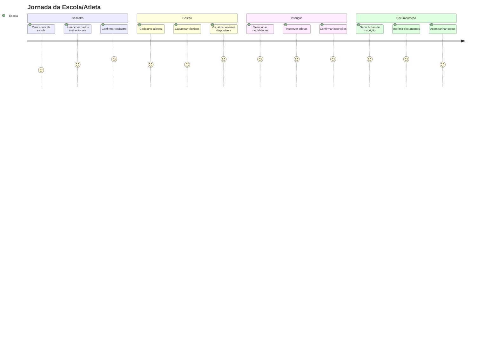
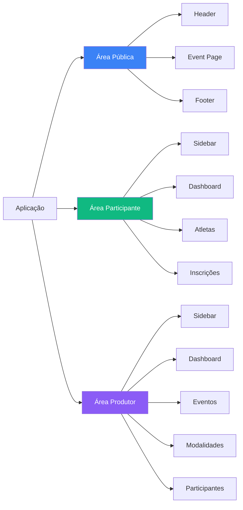
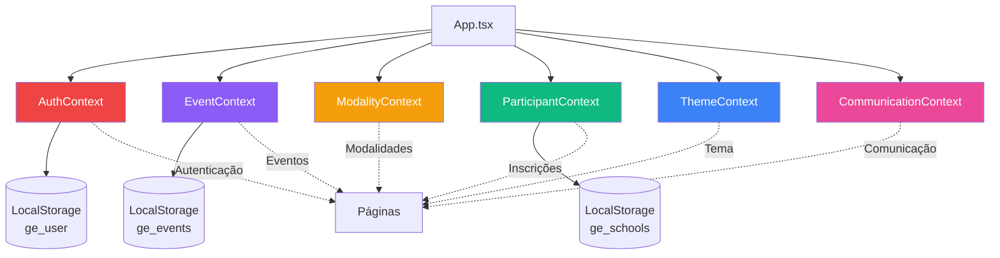
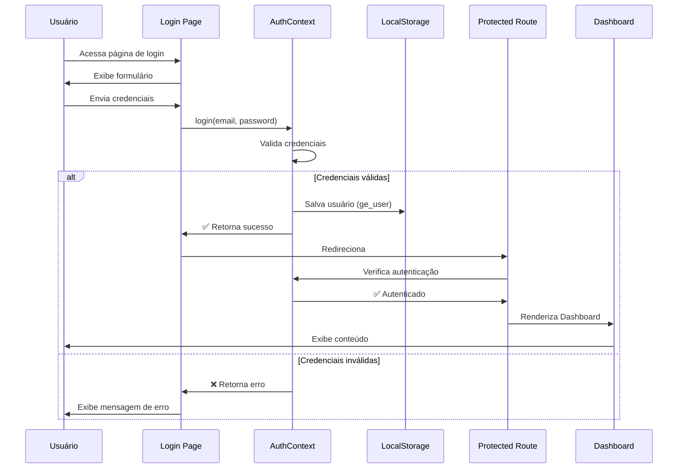
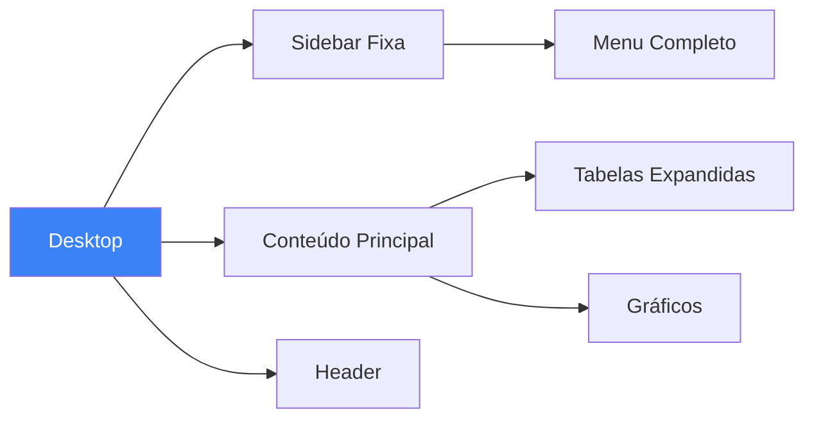
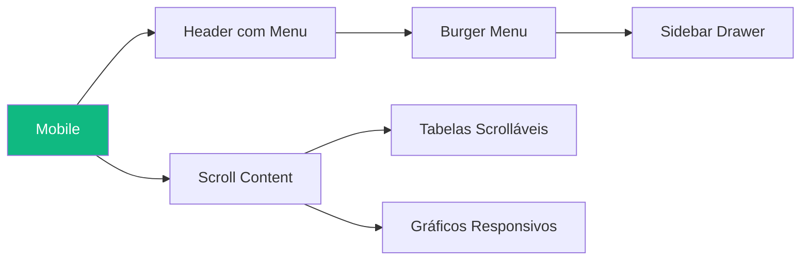

# Flowchart Simplificado de UX/UI - Gerador de Eventos

## 🎯 Visão Geral de Alto Nível

Este é um diagrama simplificado que mostra as principais jornadas do usuário na aplicação.

---

## 🔄 Jornadas Principais

### 1. Jornada do Visitante (Público)

### 2. Jornada do Participante (Escola)

### 3. Jornada do Produtor (Organizador)

---

## 🎨 Arquitetura de Componentes

### Estrutura por Área

---

## 📊 Fluxo de Dados

### Contextos e Estado Global

---

## 🔐 Fluxo de Autenticação

---

## 📱 Navegação por Dispositivo

### Desktop

### Mobile

---

## 📈 Métricas e KPIs Exibidos

### Dashboard do Produtor
- 📊 Total de Atletas Inscritos
- 🏫 Escolas Participantes (Públicas/Privadas)
- ⏰ Contadores Regressivos de Prazos
- 🏆 Estatísticas por Modalidade
- 📢 Feed de Atividades Recentes

### Dashboard do Participante
- 📅 Eventos Disponíveis
- ✅ Inscrições Confirmadas
- 👥 Atletas Cadastrados
- 📊 Distribuição por Gênero
- 🏆 Atletas por Categoria

---

## 🎯 Principais Funcionalidades por Perfil

| Funcionalidade | Público | Participante | Produtor |
|----------------|---------|--------------|----------|
| Ver Eventos | ✅ | ✅ | ✅ |
| Ver Comunicados | ✅ | ✅ | ✅ |
| Cadastrar Escola | ❌ | ✅ | ✅ |
| Gerenciar Atletas | ❌ | ✅ | ✅ |
| Fazer Inscrições | ❌ | ✅ | ❌ |
| Criar Eventos | ❌ | ❌ | ✅ |
| Gerenciar Modalidades | ❌ | ❌ | ✅ |
| Publicar Avisos | ❌ | ❌ | ✅ |
| Gerar Relatórios | ❌ | ✅ | ✅ |
| Configurar Tema | ❌ | ❌ | ✅ |

---

## 🚀 Próximos Passos Sugeridos

1. **UX Improvements**
   - Adicionar onboarding para novos usuários
   - Implementar tooltips contextuais
   - Criar atalhos de teclado

2. **Performance**
   - Implementar lazy loading de componentes
   - Adicionar cache de dados
   - Otimizar imagens

3. **Acessibilidade**
   - Melhorar navegação por teclado
   - Adicionar ARIA labels
   - Implementar modo de alto contraste

4. **Features**
   - Sistema de notificações em tempo real
   - Chat de suporte
   - Histórico de alterações

---

**Última Atualização**: 2025-12-10  
**Versão**: 1.0.0 Simplificada
