# Flowchart de UX/UI - Gerador de Eventos

Este documento apresenta o fluxo completo de navegação e interação do usuário na aplicação **Gerador de Eventos**.

## 📊 Visão Geral

A aplicação possui **3 áreas principais**:
1. **Área Pública** - Visualização de eventos sem autenticação
2. **Área do Produtor** - Gestão completa de eventos (requer autenticação)  
3. **Área do Participante** - Gestão de inscrições de escolas e atletas (requer autenticação)

---

## 🗺️ Flowchart Completo

```mermaid
flowchart TB
    Start([🌐 Usuário acessa a aplicação]) --> CheckAuth{Sistema verifica<br/>autenticação}
    
    %% ===== ÁREA PÚBLICA =====
    CheckAuth -->|Não autenticado| PublicArea[📖 ÁREA PÚBLICA]
    
    PublicArea --> PublicOptions{Escolha do usuário}
    PublicOptions -->|Acessar evento público| EventPage[📄 Página do Evento<br/>/evento/:slug/:id]
    
    EventPage --> EventPageComponents{Componentes da<br/>Página do Evento}
    EventPageComponents --> PublicHeader[🎯 Header Público<br/>- Logo do Evento<br/>- Menu de Navegação]
    EventPageComponents --> PublicHero[🎨 Hero Section<br/>- Banner/Imagem de Capa<br/>- Informações do Evento<br/>- Plantão de Notícias Urgentes]
    EventPageComponents --> NewsCarousel[📰 Carrossel de Notícias<br/>- Últimas Notícias<br/>- Cards Clicáveis]
    EventPageComponents --> PublicAbout[ℹ️ Sobre o Evento<br/>- Descrição Rich Text<br/>- Informações Institucionais]
    EventPageComponents --> PublicPartners[🤝 Parceiros<br/>- Logos de Realização<br/>- Logos de Apoio]
    EventPageComponents --> PublicFooter[🔻 Footer<br/>- Informações do Evento<br/>- Links]
    
    EventPage --> EventActions{Navegação da<br/>Página do Evento}
    EventActions -->|Ver Comunicados| EventComm[📢 Comunicação do Evento<br/>/evento/:slug/:id/comunicacao<br/>- Avisos<br/>- Boletins<br/>- Regulamentos]
    EventActions -->|Ver Regulamentos| EventReg[📋 Regulamentos<br/>/evento/:slug/:id/regulamentos<br/>- Documentos PDF]
    
    EventComm --> BackToEvent[↩️ Voltar ao Evento]
    EventReg --> BackToEvent
    BackToEvent --> EventPage
    
    PublicOptions -->|Login Produtor| ProducerLogin[🔐 Login do Produtor<br/>/]
    PublicOptions -->|Login Participante| ParticipantLogin[🔐 Login do Participante<br/>/area-do-participante/login]
    PublicOptions -->|Cadastro Participante| ParticipantRegister[📝 Cadastro de Nova Escola<br/>/area-do-participante/cadastro]
    
    %% ===== LOGIN E AUTENTICAÇÃO =====
    ProducerLogin --> ProducerLoginForm{Formulário de Login}
    ProducerLoginForm -->|Email + Senha| AuthProducer{Autenticação<br/>via AuthContext}
    
    AuthProducer -->|✅ Sucesso| ProducerDashboard[🎯 Dashboard do Produtor]
    AuthProducer -->|❌ Erro| ProducerLoginError[⚠️ Mensagem de Erro]
    ProducerLoginError --> ProducerLogin
    
    ParticipantLogin --> ParticipantLoginForm{Formulário de Login}
    ParticipantLoginForm -->|Email + Senha| AuthParticipant{Autenticação<br/>via AuthContext}
    
    AuthParticipant -->|✅ Sucesso| ParticipantDashboard[🏫 Dashboard do Participante]
    AuthParticipant -->|❌ Erro| ParticipantLoginError[⚠️ Mensagem de Erro]
    ParticipantLoginError --> ParticipantLogin
    
    ParticipantRegister --> RegisterForm{Formulário de Cadastro<br/>da Escola}
    RegisterForm -->|Dados Completos| CreateSchool[✅ Criar Escola no Sistema]
    CreateSchool --> AutoLogin[🔄 Login Automático]
    AutoLogin --> ParticipantDashboard
    
    %% ===== ÁREA DO PRODUTOR =====
    CheckAuth -->|Autenticado como Produtor| ProducerDashboard
    
    ProducerDashboard[🎯 ÁREA DO PRODUTOR<br/>/area-do-produtor/inicio]
    
    ProducerDashboard --> ProducerSidebar{Menu Lateral<br/>do Produtor}
    
    ProducerSidebar -->|Visão Geral| DashboardHome[📊 Dashboard Home<br/>- Métricas do Evento Ativo<br/>- Total de Atletas<br/>- Escolas Participantes<br/>- Contadores Regressivos<br/>- Estatísticas por Modalidade<br/>- Feed de Atividades]
    
    ProducerSidebar -->|Eventos| EventsMenu{Gerenciar Eventos}
    EventsMenu -->|Listar| EventsList[📋 Lista de Eventos<br/>/area-do-produtor/evento]
    EventsList -->|Criar Novo| EventWizard[🆕 Wizard de Criação<br/>/area-do-produtor/evento/novo<br/>- Wizard em Etapas<br/>- Dados Básicos<br/>- Datas de Inscrição<br/>- Configurações]
    EventsList -->|Editar| EventForm[✏️ Editar Evento<br/>/area-do-produtor/evento/:id<br/>- Rich Text Editor<br/>- Upload de Logos<br/>- Configurações Avançadas]
    EventForm -->|Gerenciar Produtores| EventProducers[👥 Produtores do Evento<br/>/area-do-produtor/evento/:id/produtor]
    EventForm -->|Comunicação| EventCommunication[📢 Comunicação do Evento<br/>/area-do-produtor/evento/:id/comunicacao]
    EventForm -->|Acessar Painel| EventPanel[🎛️ Painel do Evento Específico<br/>/area-do-produtor/evento/:eventId/dashboard]
    
    EventPanel --> EventPanelMenu{Menu do Painel<br/>do Evento}
    EventPanelMenu --> EventDashboard[📊 Dashboard do Evento<br/>- Métricas Específicas<br/>- Inscrições<br/>- Modalidades Associadas]
    
    ProducerSidebar -->|Modalidades| ModalitiesMenu{Gerenciar Modalidades}
    ModalitiesMenu -->|Listar| ModalitiesList[🏆 Lista de Modalidades<br/>/area-do-produtor/modalidades<br/>- Filtros Avançados<br/>- Busca<br/>- Ordenação]
    ModalitiesList -->|Criar/Editar| ModalityForm[➕ Formulário de Modalidade<br/>/area-do-produtor/modalidades/:id<br/>- Nome, Tipo, Gênero<br/>- Faixa Etária<br/>- Regras Específicas]
    
    ProducerSidebar -->|Identidade Visual| VisualMenu{Identidade Visual}
    VisualMenu -->|Listar Temas| ApplyVisualIdentity[🎨 Aplicar Identidade<br/>/area-do-produtor/identidade-visual]
    ApplyVisualIdentity -->|Criar Novo| VisualIdentityForm[🖌️ Criar Tema<br/>/area-do-produtor/identidade-visual/novo<br/>- Cores Primárias/Secundárias<br/>- Upload de Logo<br/>- Preview em Tempo Real]
    
    ProducerSidebar -->|Escolas| SchoolsMenu{Gerenciar Escolas}
    SchoolsMenu -->|Listar| SchoolsList[🏫 Lista de Escolas<br/>/area-do-produtor/escolas<br/>- Filtros por Tipo<br/>- Busca<br/>- Exportação]
    SchoolsList -->|Criar/Editar| SchoolForm[📝 Formulário da Escola<br/>/area-do-produtor/escolas/:id<br/>- Dados Cadastrais<br/>- Responsável<br/>- Endereço]
    
    ProducerSidebar -->|Atletas| AthletesMenu{Gerenciar Atletas}
    AthletesMenu -->|Listar| AdminAthletesList[⚽ Lista de Atletas<br/>/area-do-produtor/atletas<br/>- Todos os Atletas<br/>- Filtros Complexos<br/>- Exportação PDF/Excel]
    AdminAthletesList -->|Criar/Editar| AdminAthleteForm[👤 Formulário do Atleta<br/>/area-do-produtor/atletas/:id]
    AdminAthleteForm -->|Gerenciar Modalidades| AthleteModalities[🏅 Modalidades do Atleta<br/>/area-do-produtor/atletas/:id/modalidades<br/>- Inscrever em Modalidades<br/>- Visualizar Inscrições]
    
    ProducerSidebar -->|Publicações| PublicationsMenu[📣 Publicações<br/>/area-do-produtor/publicacoes<br/>- Avisos<br/>- Boletins<br/>- Regulamentos<br/>- Editor Rich Text<br/>- Upload de Arquivos]
    
    ProducerSidebar -->|Usuários| UsersMenu{Gerenciar Usuários}
    UsersMenu -->|Listar| UsersList[👥 Lista de Usuários<br/>/area-do-produtor/usuarios]
    UsersList -->|Criar/Editar| UserForm[👤 Formulário de Usuário<br/>/area-do-produtor/usuarios/:id<br/>- Dados Pessoais<br/>- Role e Permissões]
    
    ProducerSidebar -->|Sair| ProducerLogout[🚪 Logout<br/>Limpar Sessão]
    ProducerLogout --> Start
    
    %% ===== ÁREA DO PARTICIPANTE =====
    CheckAuth -->|Autenticado como Participante| ParticipantDashboard
    
    ParticipantDashboard[🏫 ÁREA DO PARTICIPANTE<br/>/area-do-participante/inicio]
    
    ParticipantDashboard --> ParticipantSidebar{Menu Lateral<br/>do Participante}
    
    ParticipantSidebar -->|Visão Geral| ParticipantHome[📊 Dashboard Home<br/>- Eventos Disponíveis<br/>- Minhas Inscrições<br/>- Atletas Cadastrados<br/>- Contadores de Prazos<br/>- Gráficos de Distribuição<br/>- Tabela de Inscritos]
    
    ParticipantHome --> ParticipantActions{Ações Disponíveis}
    ParticipantActions -->|Ver Evento Público| OpenPublicPage[🌐 Abrir Página Pública<br/>em Nova Aba]
    OpenPublicPage --> EventPage
    
    ParticipantSidebar -->|Escola| SchoolProfile[🏫 Perfil da Escola<br/>/area-do-participante/escola<br/>- Dados Cadastrais<br/>- Editar Informações<br/>- Histórico]
    
    ParticipantSidebar -->|Atletas| AthletesParticipantMenu{Gerenciar Atletas}
    AthletesParticipantMenu -->|Listar| AthletesList[⚽ Lista de Atletas da Escola<br/>/area-do-participante/atletas<br/>- Filtros<br/>- Busca<br/>- Status de Inscrição]
    AthletesList -->|Criar Novo| AthleteFormNew[➕ Novo Atleta<br/>/area-do-participante/atletas/novo<br/>- Dados Pessoais<br/>- Documentos<br/>- Responsável]
    AthletesList -->|Editar| AthleteFormEdit[✏️ Editar Atleta<br/>/area-do-participante/atletas/:id]
    AthleteFormEdit -->|Inscrever em Modalidade| AthleteInscription[🎯 Inscrição em Modalidade<br/>/area-do-participante/atletas/:id/inscricao<br/>- Selecionar Evento<br/>- Selecionar Modalidade<br/>- Confirmar Inscrição]
    
    ParticipantSidebar -->|Técnicos| TechniciansMenu{Gerenciar Técnicos}
    TechniciansMenu -->|Listar| TechniciansList[👨‍🏫 Lista de Técnicos<br/>/area-do-participante/tecnicos]
    TechniciansList -->|Criar/Editar| TechnicianForm[📝 Formulário de Técnico<br/>/area-do-participante/tecnicos/:id]
    TechnicianForm -->|Inscrever| TechnicianInscription[🎯 Inscrição de Técnico<br/>/area-do-participante/tecnicos/:id/inscricao]
    
    ParticipantSidebar -->|Ficha de Inscrição| InscriptionForms[📄 Fichas de Inscrição<br/>/area-do-participante/fichas<br/>- Filtrar por Evento<br/>- Visualizar Inscrições<br/>- Imprimir Fichas]
    
    InscriptionForms -->|Imprimir Individual| PrintableForm[🖨️ Ficha Imprimível<br/>/area-do-participante/imprimir/:eventId/:modalityId<br/>- Layout para Impressão<br/>- Dados Completos]
    
    ParticipantSidebar -->|Sair| ParticipantLogout[🚪 Logout<br/>Limpar Sessão]
    ParticipantLogout --> Start
    
    %% ===== ROTAS DE ERRO =====
    CheckAuth -->|Acesso Negado| AccessDenied[🚫 Acesso Negado<br/>/acesso-negado]
    AccessDenied --> Start
    
    CheckAuth -->|Rota Não Encontrada| NotFound[❌ 404 - Página Não Encontrada<br/>/*]
    NotFound --> Start
    
    %% ===== ESTILOS =====
    classDef publicClass fill:#3b82f6,stroke:#1e40af,color:#fff,stroke-width:2px
    classDef producerClass fill:#8b5cf6,stroke:#6d28d9,color:#fff,stroke-width:2px
    classDef participantClass fill:#10b981,stroke:#059669,color:#fff,stroke-width:2px
    classDef authClass fill:#ef4444,stroke:#b91c1c,color:#fff,stroke-width:2px
    classDef actionClass fill:#f59e0b,stroke:#d97706,color:#fff,stroke-width:2px
    classDef errorClass fill:#64748b,stroke:#475569,color:#fff,stroke-width:2px
    
    class PublicArea,EventPage,EventComm,EventReg,PublicHeader,PublicHero,NewsCarousel,PublicAbout,PublicPartners,PublicFooter publicClass
    class ProducerDashboard,DashboardHome,EventsList,EventForm,EventWizard,ModalitiesList,ModalityForm,SchoolsList,SchoolForm,AdminAthletesList,AdminAthleteForm,AthleteModalities,UsersMenu,UsersList,UserForm,PublicationsMenu,VisualIdentityForm,ApplyVisualIdentity,EventProducers,EventCommunication,EventPanel,EventDashboard producerClass
    class ParticipantDashboard,ParticipantHome,SchoolProfile,AthletesList,AthleteFormNew,AthleteFormEdit,AthleteInscription,TechniciansList,TechnicianForm,TechnicianInscription,InscriptionForms,PrintableForm participantClass
    class ProducerLogin,ParticipantLogin,ParticipantRegister,AuthProducer,AuthParticipant,ProducerLogout,ParticipantLogout authClass
    class OpenPublicPage,BackToEvent actionClass
    class AccessDenied,NotFound,ProducerLoginError,ParticipantLoginError errorClass
```



---

## 📝 Legenda de Cores

| Cor | Área | Descrição |
|-----|------|-----------|
| 🔵 **Azul** | Área Pública | Páginas e componentes acessíveis sem autenticação |
| 🟣 **Roxo** | Área do Produtor | Dashboard administrativo e gestão de eventos |
| 🟢 **Verde** | Área do Participante | Gestão de escolas, atletas e inscrições |
| 🔴 **Vermelho** | Autenticação | Login, logout e controle de acesso |
| 🟠 **Laranja** | Ações | Navegações e ações específicas |
| ⚫ **Cinza** | Erro | Páginas de erro e acesso negado |

---

## 🔑 Principais Fluxos de Navegação

### 1️⃣ Fluxo Público (Sem Autenticação)
```
Acesso → Página do Evento → [Comunicação | Regulamentos] → Voltar
```

### 2️⃣ Fluxo do Produtor
```
Login → Dashboard → [Eventos | Modalidades | Escolas | Atletas | Publicações] → Gerenciar → Logout
```

### 3️⃣ Fluxo do Participante
```
Login/Cadastro → Dashboard → [Escola | Atletas | Técnicos] → Inscrever → Imprimir Ficha → Logout
```

---

## 🎯 Componentes-Chave por Área

### Área Pública
- **EventPage**: Página principal do evento com todos os detalhes
- **PublicHeader**: Navegação e identidade visual
- **NewsCarousel**: Carrossel de notícias com cards clicáveis
- **PublicPartners**: Exibição de logos de parceiros

### Área do Produtor
- **DashboardHome**: Métricas e KPIs do evento ativo
- **EventWizard**: Criação guiada de novos eventos
- **ModalitiesList**: Gerenciamento completo de modalidades esportivas
- **SchoolsList/AthletesList**: Gestão centralizada de participantes

### Área do Participante  
- **ParticipantHome**: Dashboard com visão geral das inscrições
- **AthleteInscription**: Fluxo de inscrição em modalidades
- **InscriptionForms**: Visualização e impressão de fichas
- **SchoolProfile**: Perfil e edição dos dados da escola

---

## 🔐 Controle de Acesso

O sistema utiliza o **AuthContext** para gerenciar autenticação:

- **Roles Disponíveis**: `admin`, `producer`, `school_admin`, `technician`
- **ProtectedRoute**: Componente que protege rotas autenticadas
- **Redirecionamento**: Usuários não autenticados são redirecionados para `/`
- **Persistência**: Sessão armazenada em `localStorage` como `ge_user`

---

## 📱 Responsividade

A aplicação é **totalmente responsiva** com:
- **Breakpoints**: Mobile-first design com Tailwind CSS
- **Sidebars**: Colapsáveis em dispositivos móveis
- **Tabelas**: Com scroll horizontal e colunas redimensionáveis
- **Formulários**: Adaptados para telas pequenas

---

## 🚀 Próximos Passos

Para evolução do fluxo de UX/UI:
1. ✅ Implementar breadcrumbs para navegação hierárquica
2. ✅ Adicionar tutorial interativo para novos usuários
3. ✅ Criar atalhos de teclado para ações frequentes
4. ✅ Implementar histórico de navegação
5. ✅ Adicionar sistema de favoritos/bookmarks

---

**Gerado em**: 2025-12-10  
**Versão**: 1.0.0  
**Última Atualização**: Análise completa do codebase
